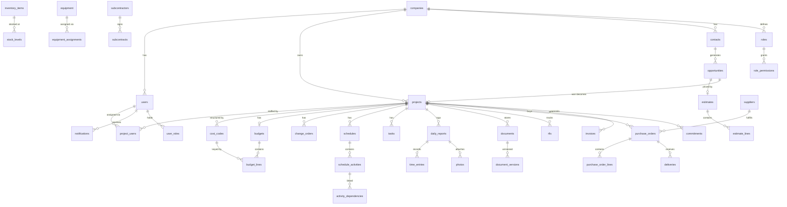

# ConstructionOS — Database Design (`database.md`)

> **Document type:** PostgreSQL schema specification
> **Status:** Draft v1.0
> **Traces to:** `spec.md` (modules M1–M18, FR-*), `architecture.md` (§17 multi-tenancy, §14 sync, §8 outbox)
> **Target:** PostgreSQL 16 + extensions: `pgcrypto`, `pgvector`, `pg_trgm`, `postgis` (optional MVP), `btree_gin`

---

## 1. Database Philosophy

1. **One system of record.** Postgres holds all transactional truth (spec §18.1). Files live in object storage; only bytes leave the database, never structure.
2. **Normalize the truth, denormalize the views.** OLTP tables target 3NF. Read models (dashboard aggregates) are separate projection tables rebuilt from events — never a reason to denormalize source tables.
3. **Isolation by construction.** Every tenant-owned table carries `tenant_id` with **Row-Level Security** (NFR-14). No exceptions, no "we filter in the app."
4. **Bias field data to append-only.** Field objects (photos, time entries, log lines) are immutable appends — this makes offline sync conflict-free by design (architecture §14.2).
5. **History is a feature.** Construction is dispute-heavy: versioning (documents, estimates), audit (financial/privileged actions), and event history are schema-level concerns, not afterthoughts.
6. **Money is exact.** All monetary values are `NUMERIC(14,2)` (amounts) / `NUMERIC(14,4)` (unit rates); quantities `NUMERIC(14,3)`. Never floats. Currency code on every money-bearing aggregate (NFR-30).
7. **UUIDv7 primary keys.** Time-ordered UUIDs: globally unique (mobile can generate ids offline — essential for sync), index-friendly (ordered inserts), non-enumerable.
8. **Evolve without breaking.** Expand-migrate-contract only; enums implemented as lookup/check tables or text + check constraints (easier evolution than native enums).

## 2. Multi-Tenancy

```sql
-- Every tenant-owned table:
tenant_id uuid NOT NULL REFERENCES companies(id)

-- Session context (set per request/transaction by the app):
SET LOCAL app.tenant_id = '<uuid>';

-- Standard RLS policy applied to every tenant table:
ALTER TABLE <t> ENABLE ROW LEVEL SECURITY;
CREATE POLICY tenant_isolation ON <t>
  USING (tenant_id = current_setting('app.tenant_id')::uuid);
```

- All composite indexes lead with `tenant_id` where the access path is tenant-scoped (they all are).
- `tenant_id` is the reserved shard key for future Citus-style scale-out (architecture §18).
- Platform tables (no `tenant_id`): `migrations`, `platform_settings`, `job_runs` (carries nullable tenant ref).

## 3. Naming Conventions

| Item | Convention | Example |
|------|-----------|---------|
| Tables | `snake_case`, plural | `purchase_orders` |
| Columns | `snake_case` | `approved_at` |
| PK | `id uuid` (UUIDv7) | |
| FK | `<singular>_id` | `project_id` |
| Junction tables | `<a>_<b>` alphabetical | `project_users` |
| Indexes | `ix_<table>_<cols>` | `ix_tasks_tenant_project_status` |
| Unique | `ux_<table>_<cols>` | `ux_users_email` |
| Check | `ck_<table>_<rule>` | `ck_budget_lines_amounts` |
| Money | `NUMERIC(14,2)` `_amount` suffix | `total_amount` |
| Timestamps | `timestamptz`, `_at` suffix | `submitted_at` |
| Booleans | `is_`/`has_` prefix | `is_active` |

**Standard columns on every tenant table** (assume present unless noted):

```sql
id          uuid PRIMARY KEY DEFAULT uuid_generate_v7(),
tenant_id   uuid NOT NULL REFERENCES companies(id),
created_at  timestamptz NOT NULL DEFAULT now(),
updated_at  timestamptz NOT NULL DEFAULT now(),   -- trigger-maintained
created_by  uuid REFERENCES users(id),
updated_by  uuid REFERENCES users(id),
deleted_at  timestamptz NULL,                     -- soft delete (§5)
updated_seq bigint NOT NULL                       -- per-tenant monotonic, drives sync deltas
```

`updated_seq` is assigned from a per-tenant sequence via trigger; it is the cursor for mobile delta sync (architecture §14.2).

## 4. ERD (high-level, Mermaid)



(Full column-level ERD is generated from the live schema by CI — `pnpm db:erd` — and committed as `docs/erd.svg`.)

## 5. Soft Deletes

- `deleted_at timestamptz NULL` on all user-manageable tables; partial indexes exclude deleted rows (`WHERE deleted_at IS NULL`).
- Soft-deleted rows still sync (as tombstones) so offline devices converge.
- Hard deletion only via GDPR erasure workflows (scheduled purge + object-store crypto-shredding, NFR-15); financial and audit records are retained per statutory rules and are *never* user-deletable (spec C1).

## 6. Audit Tables

```sql
audit_log (
  id uuid PK, tenant_id, occurred_at timestamptz NOT NULL,
  actor_id uuid NULL,            -- null = system/AI (ai_run_id set)
  actor_type text CHECK (actor_type IN ('user','system','ai','integration')),
  ai_run_id uuid NULL REFERENCES ai_runs(id),
  action text NOT NULL,          -- 'finance.invoice.approve'
  entity_type text NOT NULL, entity_id uuid NOT NULL,
  before jsonb, after jsonb,     -- diff snapshot
  ip inet, user_agent text, trace_id text
)
```

- **Purpose:** immutable record of privileged, financial, permission, and AI actions (FR-PLAT-4, FR-RBAC-4, FR-AI-6).
- **Immutability:** `INSERT`-only role; no UPDATE/DELETE grants; monthly range partitions by `occurred_at`; old partitions archived to object storage (Parquet) after 24 months.
- **Indexes:** `ix_audit_tenant_entity (tenant_id, entity_type, entity_id, occurred_at DESC)`, `ix_audit_tenant_actor (tenant_id, actor_id, occurred_at DESC)`.
- **Performance:** append-only, partitioned — no write amplification on hot paths (written by outbox consumers, not inline, except financial approvals which write synchronously).

## 7. Identity, Companies & Permissions (M18)

### `companies` — the tenant root
- **Purpose:** one row per construction company (tenant). Settings, locale, currency, plan/entitlements (jsonb), branding.
- **PK** `id`; no `tenant_id` (it *is* the tenant). **Indexes:** `ux_companies_slug`.
- **Scalability:** entitlements as jsonb lets packaging evolve without migrations; future holding structures (FR-PLAT-9) via `parent_company_id` self-FK (nullable, unused at MVP).

### `users`
- **Purpose:** global identity (a person may belong to several tenants — e.g., a sub working for two GCs).
- Columns: `email citext`, `password_hash`, `mfa_secret_enc`, `full_name`, `phone`, `avatar_url`, `locale`, `status`.
- **PK** `id`; **Unique** `ux_users_email`. Not tenant-owned; membership lives in `company_users`.

### `company_users` (junction)
- **Purpose:** user ↔ tenant membership + employment metadata (`title`, `employee_no`, `status`, `invited_by`).
- **PK** `id`; **Unique** `ux_company_users (tenant_id, user_id)`; **FKs** both sides. RLS applies (tenant_id).

### `roles`, `permissions`, `role_permissions`, `user_roles`
- `permissions`: platform-defined catalog (`key` = `module.resource.action`, seeded by migration; no tenant_id).
- `roles`: tenant-scoped (`name`, `is_system` for shipped defaults). **Unique** `ux_roles (tenant_id, name)`.
- `role_permissions`: junction, PK `(role_id, permission_key)`.
- `user_roles`: junction with **scope**: `user_id, role_id, scope_type CHECK IN ('company','project')`, `project_id NULL`. **Unique** `(tenant_id, user_id, role_id, coalesce(project_id, uuid_nil()))`. Implements spec §10.2 (company vs project roles, FR-RBAC-2).
- **Performance:** whole permission graph per user is small; loaded once per session into Redis (architecture §12).

### `external_shares`
- **Purpose:** the grant table behind client/sub/supplier scoping (FR-RBAC-3): `principal_user_id`, `audience CHECK IN ('client','subcontractor','supplier')`, `entity_type`, `entity_id`, `access CHECK IN ('view','approve','comment')`, `expires_at`.
- **Indexes:** `ix_shares_tenant_principal (tenant_id, principal_user_id)`, `ix_shares_entity (tenant_id, entity_type, entity_id)`.
- All external queries join through this table — external users have **no** direct row visibility otherwise.

### `sessions`, `api_keys`, `webhook_endpoints`, `webhook_deliveries`
- `sessions`: refresh-token family tracking, device binding, revocation (architecture §11).
- `api_keys`: hashed keys, scopes, last_used_at (public API / integrations).
- `webhook_endpoints`: tenant URL + secret + subscribed event types; `webhook_deliveries`: attempt log with response codes, partitioned monthly, pruned at 90 days.

## 8. CRM & Pre-Construction (M1)

### `contacts`
- **Purpose:** people (clients, architects, reps). `first_name`, `last_name`, `email`, `phone`, `contact_company_id NULL`, `kind`, `notes`, custom_fields jsonb.
- **Indexes:** `ix_contacts_tenant_name`, trigram index on name/email for search (`gin (name gin_trgm_ops)`).

### `contact_companies`
- **Purpose:** external organizations (client orgs, design firms). Distinct from `companies` (tenants) — deliberate: never mix tenant identity with CRM data.

### `opportunities`
- **Purpose:** deals in pipeline. `name`, `contact_id`, `contact_company_id`, `stage_id`, `expected_value_amount`, `currency`, `probability`, `expected_close_date`, `source`, `status CHECK IN ('open','won','lost')`, `lost_reason`, `won_project_id NULL REFERENCES projects(id)`.
- **FKs:** stage → `pipeline_stages` (tenant-configurable ordered stages).
- **Indexes:** `ix_opps_tenant_stage_status`, `ix_opps_tenant_close_date`.
- **Relationships:** 1→0..1 `estimates` (pre-award), 1→0..1 `projects` on win (FR-CRM-4 zero re-entry).

### `activities`
- **Purpose:** calls/emails/meetings/notes polymorphically attached (`entity_type`, `entity_id`) — used by CRM and beyond.
- **Index:** `ix_activities_tenant_entity (tenant_id, entity_type, entity_id, occurred_at DESC)`.
- **Normalization note:** polymorphic FK trades referential purity for one activity stream (spec BP14); integrity enforced at application layer + periodic consistency job. Accepted, documented.

## 9. Projects & Cost Structure (M4)

### `projects`
- **Purpose:** the central aggregate every module attaches to (spec M4).
- Columns: `name`, `code` (human key, `ux (tenant_id, code)`), `status CHECK IN ('planning','active','on_hold','closed','warranty')`, `client_contact_company_id`, `address`, `geo point NULL`, `start_date`, `target_end_date`, `actual_end_date`, `contract_value_amount`, `currency`, `health jsonb` (computed: schedule/budget/safety/quality subscores — FR-PM-2, projection-maintained), `template_id NULL`, `settings jsonb`.
- **Indexes:** `ix_projects_tenant_status`, trigram on name.
- **Scalability:** NFR-7 — child tables carry the load; `projects` stays narrow.

### `cost_codes`
- **Purpose:** WBS per project (optionally cloned from tenant-level `cost_code_templates`). `code`, `name`, `division`, `parent_id` self-FK (tree), `kind CHECK IN ('labor','material','equipment','subcontract','other')`.
- **Unique** `(tenant_id, project_id, code)`. **Index:** `ix_costcodes_project_parent`.
- **Normalization:** adjacency-list tree (depth ≤ 4 in practice); recursive CTE reads are cheap at this size; no closure table needed.

### `project_users` (junction)
- Membership + field-working-set driver (sync scope, architecture §14.2). **Unique** `(tenant_id, project_id, user_id)`.

### `milestones`, `project_templates`
- Straightforward; templates store a jsonb manifest (phases, cost codes, checklists, folder skeleton) applied at creation (FR-PM-4).

## 10. Estimating (M2)

### `estimates`
- **Purpose:** versioned pricing container. `opportunity_id NULL`, `project_id NULL` (exactly one set — `ck_estimates_parent`), `version int`, `status CHECK IN ('draft','submitted','won','lost','superseded')`, `markup_pct`, `overhead_pct`, `contingency_pct`, `tax_pct`, `subtotal_amount`, `total_amount`, `currency`, `valid_until`.
- **Unique** `(tenant_id, coalesce(opportunity_id...), version)`. FR-EST-4: new versions are new rows; totals are stored (computed on write) for cheap listing, recomputed from lines on every mutation in the same transaction — consistency over cleverness.

### `estimate_lines`
- **Purpose:** the priced scope. `estimate_id`, `cost_code_ref text` (code string pre-project), `description`, `qty NUMERIC(14,3)`, `uom`, `unit_cost_amount NUMERIC(14,4)`, `unit_price_amount`, `total_cost_amount`, `total_price_amount`, `assembly_id NULL`, `sort_order`, `source CHECK IN ('manual','assembly','ai','historical')` (+ `ai_run_id` when AI-suggested — FR-EST-7 traceability).
- **Index:** `ix_estlines_estimate (estimate_id, sort_order)`.
- **Performance:** NFR-7 — estimates reach 10k lines; listing paginates by `(estimate_id, sort_order)`; totals maintained on parent avoids scan-per-view.

### `assemblies`, `assembly_items`, `cost_items`
- `cost_items`: tenant cost book (`code`, `description`, `uom`, `current_unit_cost_amount`, `labor_hours_per_unit`); updated from procurement actuals via projection (spec M2 integration).
- `assemblies` + `assembly_items` (junction to cost_items with `qty_per_unit`): reusable build-ups.
- `cost_item_price_history`: append-only price observations (`source CHECK IN ('po','invoice','manual','supplier_quote')`) — the raw feed for Estimator/Procurement AI (FR-PROC-5).

### `bid_packages`, `bid_invitations`, `bids`
- Bid process to subs (FR-EST-6): package (scope + docs), invitation (sub + due date + status), bid (amount, inclusions/exclusions jsonb, leveled_score). Links: `bid_packages.project_id`, `bid_invitations.subcontractor_id`, `bids.bid_invitation_id`.

## 11. Financials (M9)

> The chain **budget → commitment → actual → forecast** is the platform's financial spine (spec BP4, FR-FIN-*). All writes transactional; all mutations audited.

### `budgets`
- **Purpose:** one active budget per project (1:1, `ux (tenant_id, project_id)` where status='active'). `source_estimate_id` (FR-EST-5 provenance), `status`, `original_total_amount`, `revised_total_amount`, `currency`.

### `budget_lines`
- **Purpose:** per-cost-code money columns: `budget_id`, `cost_code_id`, `original_amount`, `approved_changes_amount`, `revised_amount` (generated column = original + approved_changes), `committed_amount`, `actual_amount`, `forecast_to_complete_amount`, `forecast_at_completion_amount`.
- **Unique** `(budget_id, cost_code_id)`.
- **Consistency design:** `committed_amount`/`actual_amount` are **maintained by triggers/use-cases in the same transaction** as the source rows (commitments, cost transactions) — the live-margin view (FR-FIN-3) is a plain read, always exact, no reconciliation job. `ck_budget_lines_amounts` enforces non-negative constraints.
- **Performance:** the single most-read financial table; `(budget_id)` clustered access, ≤ few thousand rows/project — trivially fast.

### `commitments`
- **Purpose:** contractual obligations (POs + subcontracts unified): `kind CHECK IN ('purchase_order','subcontract')`, `source_id` (PO/subcontract id), `project_id`, `cost_code_id`, `amount`, `status`. Written when a PO/subcontract is approved (FR-PROC-3).

### `cost_transactions`
- **Purpose:** the append-only ledger of actual costs: `project_id`, `cost_code_id`, `source CHECK IN ('supplier_invoice','sub_invoice','time_entry','equipment_usage','inventory_issue','manual','accounting_sync')`, `source_id`, `txn_date`, `amount`, `qty`, `uom`, `memo`, `external_ref` (accounting id).
- **Indexes:** `ix_costtxn_tenant_project_code_date`, `ix_costtxn_source (source, source_id)` (idempotent sync upserts).
- **Partitioning:** monthly range partitions by `txn_date` at scale (high-volume append table).
- **Normalization:** deliberately a *ledger* (facts), with budget_lines as maintained aggregates — the classic OLTP ledger/rollup pair.

### `change_orders`, `change_order_lines`
- `change_orders`: `project_id`, `number` (`ux (tenant_id, project_id, number)`), `title`, `reason`, `status CHECK IN ('draft','pending_client','approved','rejected','void')`, `cost_impact_amount`, `price_impact_amount`, `schedule_impact_days`, `client_approved_by/at`, `client_approval_channel`.
- Lines mirror estimate_lines per cost code. On approval (one transaction): budget_lines.approved_changes update + schedule impact event + client-portal visibility (FR-FIN-2 propagation; audit-logged; approval via portal writes `external_shares`-verified actor).

### `invoices`, `invoice_lines`, `payments`
- `invoices`: unified AP/AR — `direction CHECK IN ('payable','receivable')`, `counterparty_type/id` (client company, supplier, subcontractor), `project_id NULL`, `number`, `status`, `issue_date`, `due_date`, `subtotal/tax/total_amount`, `external_ref`.
- `payments`: applied amounts vs invoices (partial payments supported).
- **Indexes:** `ix_invoices_tenant_dir_status_due` (AR aging query), `ux (tenant_id, direction, number)`.

### `payment_applications`, `payment_application_lines`
- AIA-style progress billing (FR-FIN-4): period, per-cost-code `scheduled_value`, `previous_completed`, `this_period`, `stored_materials`, `retainage_pct/amount`, generated G702/G703 PDF ref in documents.

### `accounting_links`
- Mapping table for two-way sync (FR-PLAT-8): `entity_type`, `entity_id`, `provider CHECK IN ('quickbooks','sage','xero')`, `external_id`, `last_synced_at`, `sync_state jsonb`. **Unique** `(tenant_id, provider, entity_type, external_id)`.

## 12. Procurement (M5) & Inventory (M10)

### `suppliers`
- `name`, `contact info`, `terms`, `default_lead_time_days`, `rating jsonb` (AI-maintained score: on-time %, price index, dispute count — FR-PROC-5), `status`.

### `purchase_orders`, `purchase_order_lines`
- PO: `number` (`ux (tenant_id, number)`), `project_id`, `supplier_id`, `status CHECK IN ('draft','pending_approval','approved','sent','confirmed','partially_received','received','closed','cancelled')`, `order_date`, `required_by_date`, `promised_date`, `ship_to`, totals, `approved_by/at`, `ai_run_id NULL` (AI-drafted, FR-PROC-6).
- Lines: `inventory_item_id NULL` or free-text `description`, `cost_code_id`, `qty_ordered/received`, `uom`, `unit_cost_amount`, `line_total_amount`.
- **Indexes:** `ix_po_tenant_project_status`, `ix_po_supplier_status`.
- **State machine enforced in application layer**; status transitions audited. Approval → `commitments` row (same transaction).

### `rfqs`, `rfq_lines`, `supplier_quotes`
- Quote workflow feeding PO creation and `cost_item_price_history`.

### `deliveries`, `delivery_lines`
- Receipt against PO lines (`qty_received`, `received_by`, photos via attachments); triggers `stock_levels` update (on-site receipt) and 3-way-match state for supplier invoices (FR-VEND-2).

### `inventory_items`, `inventory_locations`, `stock_levels`, `stock_movements`
- `inventory_items`: catalog (`sku` `ux (tenant_id, sku)`, `uom`, `min_qty`, `default_unit_cost_amount`, `category`).
- `inventory_locations`: warehouses & job-site stores (`project_id NULL` for site locations).
- `stock_levels`: **maintained aggregate** `(item_id, location_id) unique`, `qty_on_hand`.
- `stock_movements`: **append-only ledger** — `kind CHECK IN ('receipt','issue','transfer_out','transfer_in','adjustment','return')`, `item_id`, `from/to location`, `qty`, `unit_cost_amount`, `project_id/cost_code_id NULL` (issues → cost_transactions).
- Same ledger/rollup pattern as financials; movements partitioned at scale. (FR-INV-1..3)

## 13. Equipment (M11)

### `equipment`
- Registry: `asset_no` (`ux tenant`), `name`, `category`, `make/model/serial`, `ownership CHECK IN ('owned','rented','leased')`, `hourly_cost_rate_amount`, `daily_cost_rate_amount`, `status CHECK IN ('available','assigned','maintenance','retired')`, `current_project_id NULL`, `telematics jsonb NULL` (GPS roadmap).

### `equipment_assignments`
- `equipment_id`, `project_id`, `start_at`, `end_at NULL`, `assigned_by`. **Exclusion constraint** (`EXCLUDE USING gist` on equipment_id + tstzrange) prevents double-assignment — DB-level guarantee (FR-EQ-1).

### `equipment_usage_logs`
- Append-only: hours/odometer per day (field-captured), `operator_id` → generates `cost_transactions` at the equipment rate (FR-EQ-2).

### `maintenance_schedules`, `maintenance_work_orders`, `equipment_inspections`
- Recurrence rules (every N hours/days), due-state projection feeds reminders (FR-EQ-3); work orders track cost (parts/labor) to overhead or project.

## 14. Scheduling (M7)

### `schedules`
- One active + baselines per project: `kind CHECK IN ('master','baseline','lookahead')`, `baseline_of_id NULL` self-FK, `data_date`.

### `schedule_activities`
- `schedule_id`, `wbs_path`, `name`, `duration_days`, `start_date`, `end_date`, `actual_start/end`, `percent_complete`, `is_milestone`, `is_critical` (computed by CPM engine, stored), `total_float_days`, `crew jsonb`, `cost_code_id NULL`, `calendar_id`.
- **Indexes:** `ix_activities_schedule_start (schedule_id, start_date)`, `ix_activities_tenant_dates` (cross-project resource views, FR-SCH-5).
- **Performance:** CPM recalculation runs in a worker for schedules > 500 activities (job queue), synchronously below that; results written back in one transaction with a `schedule_version` bump for cheap client cache invalidation.

### `activity_dependencies`
- `predecessor_id`, `successor_id`, `type CHECK IN ('FS','SS','FF','SF')`, `lag_days`. **PK** `(predecessor_id, successor_id)`; cycle detection at application layer before commit.

### `resource_assignments`
- Crew/equipment ↔ activity with tstzrange; overlap queries via gist index (conflict surfacing FR-SCH-5).

## 15. Tasks, Field & Safety (M6, M8, M12)

### `tasks`
- `project_id`, `title`, `description`, `status CHECK IN ('todo','in_progress','blocked','done','cancelled')`, `priority`, `due_date`, `assignee_id`, `kind CHECK IN ('task','punch')`, `location_ref` (drawing pin: `document_version_id` + x/y), `schedule_activity_id NULL`, `rfi_id NULL`, `checklist jsonb`.
- **Indexes:** `ix_tasks_tenant_assignee_status_due` (my-work query), `ix_tasks_project_status`.
- Punch items are `kind='punch'` — same table, shared machinery (FR-TASK-2), differentiated UX.

### `daily_reports`
- One per project/day/author (`ux (tenant_id, project_id, report_date, created_by)`): `report_date`, `weather jsonb` (auto-filled + editable), `narrative`, `status CHECK IN ('draft','submitted')`, `submitted_at`, `ai_summary text NULL` (FR-FIELD-6).
- **Offline-first:** created on device with client-generated UUID; append-biased children below (architecture §14.2).

### `time_entries`
- Append-only: `daily_report_id NULL`, `project_id`, `user_id` (or `crew_labels`), `cost_code_id`, `hours NUMERIC(5,2)`, `work_date`, `kind CHECK IN ('regular','overtime')`, `approved_by/at`. Approval → `cost_transactions` at labor rate (FR-FIELD-2). Monthly partitions at scale. **Index:** `ix_time_tenant_user_date`, `ix_time_project_date`.

### `photos`
- Append-only: `object_key`, `taken_at`, `geo point NULL`, `heading`, `device_id`, `entity_type/entity_id` (report, task, delivery, incident…), `ai_tags jsonb` (Photo AI: labels, detected issues, confidence — FR-FIELD-7), `thumb_key`.
- **Indexes:** `ix_photos_tenant_project_taken`, GIN on `ai_tags`.
- **Scalability:** highest-volume table; monthly partitions; bytes in object storage only.

### `field_issues`
- Field-raised blockers: convertible to task/RFI (`converted_entity_type/id`), severity, photos.

### Safety: `safety_forms`, `safety_form_templates`, `incidents`, `certifications`
- `safety_form_templates`: tenant-configurable jsonb form schemas (toolbox talk, inspection checklists).
- `safety_forms`: filled instances (`template_id`, `project_id`, `responses jsonb`, signatures jsonb, offline-created).
- `incidents`: `kind CHECK IN ('incident','near_miss','observation')`, `severity`, `occurred_at`, `location`, `people jsonb`, `status`, `corrective_action_task_id NULL` (FR-SAFE-3), OSHA-recordable flag.
- `certifications`: person/sub ↔ cert type, `expires_at` (expiry projections drive alerts + sub eligibility gating, FR-SAFE-2/FR-SUB-2).

## 16. Documents & RFIs (M3)

### `documents`, `document_versions`, `folders`
- `folders`: project tree (adjacency list), `inherited_acl jsonb NULL` for folder-level shares.
- `documents`: logical doc — `folder_id`, `name`, `category CHECK IN ('drawing','spec','contract','permit','submittal','photo_album','report','other')`, `current_version_id` (FK, deferred).
- `document_versions`: immutable — `version_no`, `object_key`, `size`, `mime`, `checksum sha256`, `uploaded_by`, `drawing_meta jsonb` (sheet no, discipline, revision, scale), `text_extracted bool`, `page_count`.
- **Unique** `(document_id, version_no)`. FR-DOC-2: "current" is a single FK — unambiguous by construction.
- **Indexes:** trigram on `documents.name`; `ix_docversions_doc (document_id, version_no DESC)`.

### `drawing_sets`, `drawing_set_sheets`
- Named issued sets (e.g., "IFC 2026-03-01") — junction to specific `document_versions`; the field working set pins one set (FR-DOC-5 offline determinism).

### `rfis`
- `number` (`ux tenant+project`), `subject`, `question`, `answer`, `status CHECK IN ('draft','open','answered','closed','void')`, `assigned_to_contact_id` (external A/E), `due_date`, `cost_impact_flag`, `schedule_impact_flag`, `linked_activity_id NULL`, `linked_drawing_ref`.

### `submittals`
- Spec-section keyed, `status` workflow (draft→submitted→reviewed→approved/rejected/resubmit), reviewer, due dates, version chain to document_versions.

### `annotations`
- Markups on document_versions: `page`, `geometry jsonb`, `author`, `kind` — kept separate from bytes so versions stay immutable.

## 17. Portals & External Parties (M13–M15)

### `subcontractors`
- Company-level registry (`name`, `trades text[]`, `contact`, `prequal_status`, `performance jsonb` AI score — FR-SUB-4). Portal users are `users` + `company_users(kind='external')` + `external_shares`.

### `subcontracts`, `subcontract_lines`
- Contract per project/sub: scope, amounts per cost code, retainage_pct, status; approval creates `commitments` (mirror of PO flow, FR-SUB-3).

### `sub_invoices` → unified in `invoices` (`direction='payable'`, counterparty=subcontractor) — one AP pipeline, no parallel tables.

### `client_selections`
- Client-facing choices (allowances/options): `title`, `options jsonb`, `allowance_amount`, `selected_option`, `status`, `decided_by/at` — approval events feed change orders where cost-impacting (FR-CLIENT-2).

### `portal_messages`
- Threaded external communication scoped to `entity_type/id` with `audience` — kept separate from internal `comments` so internal chatter can never leak (FR-CLIENT-4 by construction).

### `comments`
- Internal polymorphic comment stream (tasks, RFIs, POs…): `entity_type/id`, `body`, `mentions uuid[]` (drives notifications).

## 18. Notifications (M18)

### `notifications`
- Per-recipient: `user_id`, `kind`, `title`, `body`, `entity_type/id`, `read_at`, `channel_state jsonb` (per-channel delivery status), `priority`.
- **Indexes:** `ix_notif_tenant_user_unread (tenant_id, user_id) WHERE read_at IS NULL`; monthly partitions, 12-month retention.

### `notification_preferences`
- `(user_id, category, channel)` matrix → `enabled`, `digest CHECK IN ('instant','hourly','daily')` (FR-PLAT-5).

## 19. AI Tables (M17 — schema side; behavior in `ai-spec.md`)

### `embeddings`
- `entity_type`, `entity_id`, `chunk_no`, `content_hash`, `embedding vector(1024)`, `meta jsonb` (permission hints: project_id, category).
- **Indexes:** HNSW on `embedding` (partitioned per tenant at scale); `ux (tenant_id, entity_type, entity_id, chunk_no, content_hash)` for idempotent re-embedding.
- RLS applies — retrieval inherits tenant isolation at the index (architecture §7).

### `ai_conversations`, `ai_messages`
- Assistant threads per user + surface context (`module`, `entity_ref`); messages store role, content, `tool_calls jsonb`, token counts.

### `ai_runs`
- **Every** model invocation: `purpose`, `prompt_template_id`, `model`, `input_tokens/output_tokens`, `cost_usd NUMERIC(10,6)`, `latency_ms`, `confidence NUMERIC(3,2) NULL`, `sources jsonb`, `outcome CHECK IN ('shown','accepted','rejected','auto_applied','escalated','error')`.
- The backbone of FR-AI-4/6, NFR-27 metering, and the evaluation loop; monthly partitions.

### `ai_memories`
- Durable per-user/tenant preferences and learned context (`scope`, `key`, `content`, `embedding NULL`, `expires_at NULL`) — governed, user-visible, deletable.

### `automations`, `automation_runs`
- Tenant-configured rules: `trigger_event`, `conditions jsonb`, `actions jsonb`, `is_enabled`, `requires_confirmation`; runs table logs every firing with outcome (spec automation goals, auditability).

## 20. Sync & Events (platform)

### `outbox`
- `event_type`, `payload jsonb`, `dedupe_key ux`, `occurred_at`, `published_at NULL`. Written transactionally with domain changes; relay publishes to NATS and stamps `published_at`; pruned after 7 days (architecture §8).

### `sync_mutations`
- Server-side applied-mutation log: `client_id`, `mutation_id ux`, `user_id`, `entity_type/id`, `applied_at`, `result CHECK IN ('applied','merged','conflict','rejected')`, `conflict_detail jsonb NULL` — idempotency + the audit trail for NFR-10 ("nothing lost, ever").

### `job_runs`
- Worker job audit: queue, payload hash, attempts, status, error, duration — DLQ triage surface.

## 21. Reports (M16)

### `report_definitions`, `report_runs`
- Definitions: tenant-saved report configs (`kind`, `params jsonb`, `schedule cron NULL`, `recipients`). Runs: generated artifacts (object_key of PDF/XLSX, status, duration) via job queue (FR-EXEC-2).

### `projection_*` tables (read models)
- `projection_project_financials` (per project: revised budget, committed, actual, forecast, margin %, updated_at) — powers dashboards at NFR-4 speeds.
- `projection_company_kpis` (daily snapshot per tenant: pipeline value, WIP, cash position, overdue AR, safety TRIR…).
- Rebuilt from events; **disposable by design** (`pnpm projections:rebuild`); never a source of truth.

## 22. Cross-Cutting Notes

- **Junction tables in this design:** `company_users`, `user_roles`, `role_permissions`, `project_users`, `assembly_items`, `drawing_set_sheets`, `resource_assignments`, `external_shares` (grant junction), `notification_preferences`.
- **Indexing policy:** every FK gets an index unless measured useless; composite indexes lead with `tenant_id`; partial indexes for hot filtered states (`WHERE status='open' AND deleted_at IS NULL`); JSONB GIN only where queried (ai_tags, entitlements); trigram GIN for user-facing search fields. Index budget reviewed quarterly against `pg_stat_user_indexes` (write-amplification control).
- **Partitioning roster (activated by volume triggers, not speculatively):** `audit_log`, `photos`, `cost_transactions`, `stock_movements`, `time_entries`, `notifications`, `ai_runs`, `webhook_deliveries` — all append-heavy, time-keyed.
- **Statement timeouts:** 5 s interactive role, 5 min worker role; all long work belongs in queues.
- **Future scalability:** every table already carries the shard key (`tenant_id`); read models are rebuildable; ledgers are append-only — the three properties that make later scale-out (replicas → Citus → extracted analytics) mechanical rather than a redesign.

---

*End of `database.md` v1.0.*
